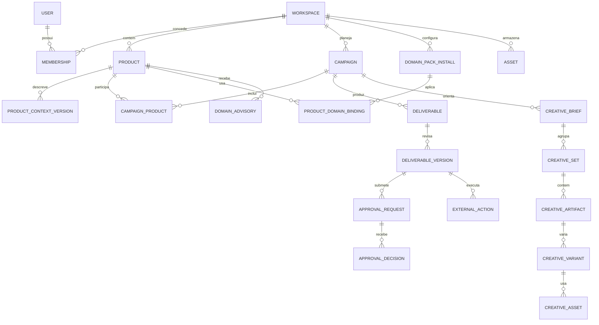

# DOMAIN_MODEL

## Agregados e relacionamentos

## Entidades

| Entidade | Campos essenciais | Invariantes |
| --- | --- | --- |
| Workspace | `id`, `name`, `slug`, `status`, `created_at` | Unidade de isolamento e cobrança; não equivale a um Product |
| User/Membership | `user_id`, `workspace_id`, `role`, `status` | Principal autenticado e papel resolvidos no servidor; um usuário pode participar de vários Workspaces |
| Product | `id`, `workspace_id`, `name`, `slug`, `status`, `owner_id`, `default_locale` | Pertence a exatamente um Workspace; slug único nele; arquivar preserva histórico |
| ProductContextVersion | `id`, `product_id`, `schema_version`, `version`, `status`, `body`, `content_hash`, `created_by`, `approved_by`, `effective_at` | Imutável após publicação; um Product aponta para uma versão ativa; draft e published separados |
| EvidenceSource/Claim | fonte, data de observação, escopo, trecho/localização, classificação, validade | Alegações não ganham grau `proven` sem evidência rastreável; fontes importadas são dados |
| DomainPack/Install/Binding | ID, versão, status, escopo, configuração, Product alvo | Pack é opcional; instalação no Workspace e ativação explícita no Product; versão fica fixada em cada trabalho |
| DomainAdvisory | `id`, Workspace/Product/Campaign, tarefa, status, versão de Product Context e Domain Pack, fatos, claims, restrições, riscos, fontes, run ID | Parecer imutável e rastreável; `APPROVED` significa revisão de domínio aprovada, não campanha autorizada |
| Campaign | `id`, `workspace_id`, `name`, `objective`, `status`, `owner_id`, `start_at`, `end_at` | Campanha pertence ao Workspace; pode referenciar um ou mais Products do mesmo Workspace |
| CampaignProduct | `campaign_id`, `product_id`, `role`, `context_version_id` | Exige um Product principal; versões fixadas por produto no brief |
| CampaignBrief | `campaign_id`, `version`, audiência, oferta, mensagem, canais, CTA, metas, restrições | Revisões versionadas; geração usa versão explicitamente fixada |
| WorkItem | `id`, `campaign_id`, `type`, `assignee`, `status`, `depends_on` | Representa pesquisa, texto, SEO, social ou email, inclusive dependências sequenciais |
| Deliverable/Version | tipo, formato, conteúdo/asset, responsável, fontes, status, versão, `context_version_id`, `brief_version` | Conteúdo aprovado é snapshot imutável; revisão cria versão nova |
| CreativeBrief | objetivo, público, oferta, mensagens, CTA, fontes, canais/formatos, restrições, dimensões/duração, variantes e métrica | Versão fixa os inputs aprovados usados na geração |
| CreativeSet | `id`, `brief_id`, nome, hipótese e conjunto de entregas | Agrupa kit ou experimento; cada item tem revisão própria |
| CreativeArtifact/Variant | tipo, formato, canal, fonte, versão, status, run ID, hipótese e diferença da variante | Cada variante referencia o master; mudança cria versão nova e invalida aprovação anterior |
| CreativeAsset | `asset_id`, Blob key, MIME, dimensões/duração, provider/modelo, parâmetros, custo, licença, direitos, consentimento | Binário pertence ao OS; uso externo exige direito conhecido e decisão sobre a versão exata |
| ApprovalRequest/Decision | alvo e hash, tipo de decisão, aprovador, escopo, deadline, decisão e motivo | Decisão vale apenas para o snapshot e parâmetros exibidos |
| ExternalAction | tipo, provedor, payload hash, idempotency key, estado, ID externo, ator, timestamps | Executa somente snapshot liberado e registra resposta/reconciliação |
| Asset/ExternalReference | chave Blob, MIME, tamanho, dono, origem; ou provedor, ID e URL | Referência externa não substitui conteúdo e metadados internos |
| AuditEvent | ator, ação, alvo, antes/depois ou hashes, instante, correlação | Append-only para contexto, permissões, aprovações e execução |

## Hierarquia de contexto

Workspace guarda identidade organizacional e políticas comuns; Product guarda fatos, posicionamento e voz próprios; Campaign guarda intenção temporária; Deliverable guarda a versão do trabalho. Preferências do usuário são pessoais e não alteram fatos do produto. Se houver conteúdo de vários Products em uma Campaign, cada entrega declara o Product principal e quais outros podem ser mencionados. Conflitos entre contextos viram questão para revisão, não fusão silenciosa.

## Regras de armazenamento e acesso

Todas as tabelas de negócio carregam `workspace_id` diretamente ou o obtêm por uma relação verificada; índices e FKs compostas evitam vínculo entre Workspaces. Product Context, Brief e Deliverable usam versões imutáveis e `content_hash`. Assets carregam dono e escopo no banco; a chave Blob não é prova de permissão. Exclusão operacional prefere arquivamento e retenção; deleção permanente, quando necessária, segue política de dados com auditoria.

## Extensão v2: Agency e Client

O `Workspace` legado acima torna-se `ClientWorkspace`; os contratos novos usam `client_workspace_id` e incluem `agency_id`. `AgencyTenant(id, status, owner, policy_version)` possui Clients e `AgencyMembership(user_id, agency_id, role, status)`. `ClientWorkspace(id, agency_id, status, owner)` possui `ClientWorkspaceMembership(user_id, agency_id, client_workspace_id, role, status)`, `ClientPolicy(version, rules, effective_at)`, `AdvisorProfile(version, product_id?, refs, agent_binding)`, `ClientIntegration(provider, credential_ref, health)` e `ExternalAccount(platform, external_account_id, permissions)`. Toda entidade operacional está sob um Client, com FK composta que impede referência cruzada. Produto/brand e campanhas multproduto permanecem dentro de um único Client. Domain Pack reutilizável pode ser privado da Agency ou do Client; instalação/binding e acesso exigem ambos os escopos.

| Núcleo adicional | Relação e invariantes |
| --- | --- |
| WorkRequest e AgentRun/Event | Request pertence ao Client e pode gerar Run; Run é persistido antes de chamar Eve e fixa policy/context/profile/brief, principal, custo e status |
| AudienceResearch/Source, AudienceSegment/Version, Persona/Version/Evidence | Pertencem ao Client/Product; Segment é critério objetivo, Persona é interpretação com evidência e revisão |
| TargetingHypothesis, MarketingHypothesis, AudienceExperiment | Versão e fontes vinculadas a Product/Campaign; inferência não vira fato automaticamente |
| Experiment/Arm/Metric/Observation/Decision | Pertencem ao Client/Campaign; braço fixa Artifact/Audience/Offer, métrica tem definição e janela |
| Publication/ExternalAction e mappings | Versão publicada, destino, ExternalAccount, aprovação, idempotência e estado reconciliado têm o mesmo Client owner |
| CampaignMetricDefinition/ChannelMetricMapping/MetricSnapshot/AttributionSnapshot/PerformanceTarget | Preservam valor nativo, normalizado, definição, fonte, janela e freshness |
| PerformanceRecommendation e BudgetPolicy | Recomendação é proposta; policy determinística limita custo/spend e mudança exige aprovação |
| Report/CostRecord/AuditEvent | Relatório é snapshot autorizado; custo aloca Agency/Client/Product/Campaign/Run; auditoria registra ator e escopo |

Supabase Auth identifica o principal; RLS em tabelas expostas e API validam Agency e Client, com testes allow/deny. Chaves externas compostas e checagens de ownership também cobrem Product, Campaign, AgentRun, Approval, Asset e ExternalAccount. Agregados da Agency filtram Client por membership antes de comparar métricas. O [modelo de Client](./CLIENT_WORKSPACE_MODEL.md) detalha ciclo de vida e o [modelo de integrações](./CLIENT_INTEGRATION_MODEL.md) detalha credenciais e contas.

## Extensão 2.1: Engagement e Lead futuro

As entidades abaixo são modelo alvo, não tabelas existentes. Em todo vínculo, `(agency_id, client_workspace_id)` é ownership obrigatório e Product/Campaign/integração devem pertencer ao mesmo Client. O [Engagement Architecture](./ENGAGEMENT_ARCHITECTURE.md) define o processo, [Agentic Email](./AGENTIC_EMAIL_MARKETING_SPEC.md) especializa o canal inicial e [Lead Qualification](./LEAD_QUALIFICATION_MODEL.md) define o futuro recorte individual.

| Entidade | Relação e invariantes |
| --- | --- |
| EngagementChannel/ClientChannelBinding | Canal entre `EMAIL`, `WHATSAPP`, `SMS`, `INSTAGRAM_DM`, `FACEBOOK_MESSENGER`, `WEB_CHAT`; binding resolve ClientIntegration, identidade externa e capacidades reais; apenas Email é primeira entrega |
| EngagementCampaign/Broadcast/Sequence/Step | Campaign e Product do mesmo Client, objetivo, Segment/versão, Artifact/versão, estado e janela; Broadcast é envio único, Sequence ordena etapas condicionais |
| EngagementTemplate/Experiment | Template versionado de conteúdo; Experiment fixa hipótese, variantes, métrica e janela antes da execução |
| EngagementEvent/PerformanceSnapshot | Evento observado com provider ID, origem, tempo, deduplicação; snapshot preserva definição, janela, freshness e limitações |
| Consent/identidade de contato para Email | Primeira fase de Engagement: elegibilidade por Client, canal e finalidade, com prova, opt-out e supressão, mesmo sem Lead completo |
| Lead/LeadIdentity/LeadSource | Roadmap: Lead individual do Client, identidades por canal e origem vinculada a Campaign; IDs externos não são autoridade |
| LeadQualification/ConversationThread/Handoff | Roadmap: avaliação versionada e evidenciada, thread por canal e snapshot minimizado reconciliado com CRM |

`AudienceSegment` define população/critério; `Lead` futuro é contato individual. `Consent` já acompanha identidade, canal e finalidade no Email, com histórico para opt-in/opt-out e supressão; o vínculo com LeadIdentity é evolução posterior. `Handoff` é fronteira: o OS preserva evidência de marketing, enquanto opportunity/pipeline/sales/customer lifecycle pertencem ao CRM. O contrato de persistência, cardinalidades e retenção precisa ser fechado nas SPECs futuras antes de migrations.
